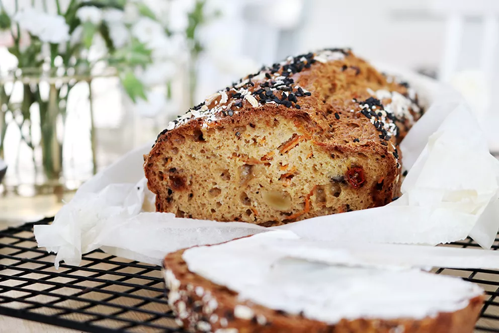

---
tags:
    - sverige
    - frukost
---
# Morotsbröd med valnötter och gojibär

## Ingredienser

- 5 dl havregryn
- 2 dl dinkelmjöl
- 2 tsk bikarbonat
- 1 tsk salt
- 2 ägg
- 3,5 dl naturell yoghurt 3%/filmjölk 3%
- 100 g riven morot
- 1 stor näve gojibär
- 70 g grovt hackade valnötter
- Svarta sesamfrön att strö över brödet innan gräddning

Att strö över innan  gräddning:

- Sesamfrön
- Svarta sesamfrön
- Hackade valnötter

## Gör så här

1. Värm ugnen till 175 grader.
2. Mixa havregrynen i en matberedare till en fint mjöl, blanda i dinkelmjöl, salt och bikarbonat. Blanda.
3. Vispa upp äggen tills de är tjockt och lite fluffigt.
4. Riv morötterna och hacka valnötterna och ta fram gojibären.
5. Blanda allt i en bunke. Det blir en kletig smet. Häll över i en form som du klätt med med bakplåtspapper. Jämna till och strö över svarta sesamfrön och havregryn.
6. Grädda i mitten av ugnen i ca 1 timma eller tills brödet är 98 grader inuti.
