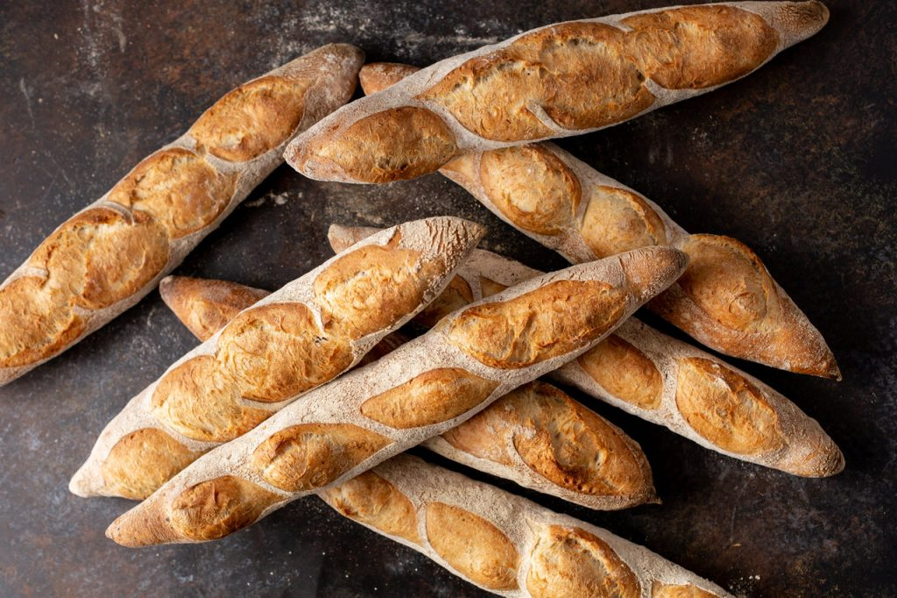

---
tags:
    - frankrike
    - brunch
    - lunch
    - middag
---
# Baguette

## Ingredienser

- 520 g fingervarmt vatten
- 12 g jäst
- 1 tsk salt
- 700 g vetemjöl

## Gör så här

1. Häll vattnet i en bunke och smula ner jästen. Rör om tills jästen löst sig.
2. Blanda i salt.
3. Tillsätt mjölet och arbeta ihop till en kladdig deg.
4. Täck skålen och låt jäsa i 45 minuter.
5. Ta upp degen ur skålen och vik den med blöta händer. Upprepa detta ytterligare 3 gånger med 45 minuters mellanrum.
6. Efter den sista jäsningen delar du upp deg i 4 lika stora bitar. Forma dem som små paket där kanterna viks inåt, och du rullar ihop dem i slutet, och täck med oljad plastfolie. Låt vila i 15 minuter.
7. Forma bitarna till baguetter och lägg dem på en väl mjölad bakduk. Låt jäsa i 20 minuter.
8. Sätt ugnen på 220°C. Ställ en bricka med hett vatten på ugnens nedersta hylla. Låt degen vila ytterligare 10–12 minuter medan ugnen värms upp.
9. Lägg baguetterna på lätt smorda bakplåtar, spraya med lite vatten och skåra dem.
10. Sätt in baguetterna i den varma ugnen, spraya in lite vatten i ugnen och grädda i 16–20 minuter. Ta ut och låt svalna på ett galler.
