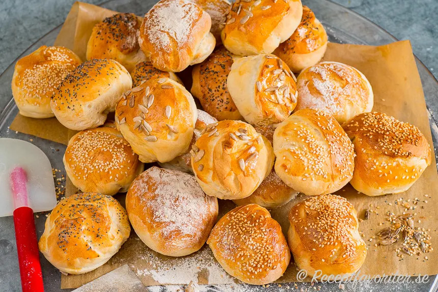

---
tags:
    - frukost
    - brunch
    - lunch
---
# Bullar på två dagar

## Ingredienser

- 4 dl kallt vatten
- 12 g färsk jäst
- 1 tsk socker (kan uteslutas)
- 2 msk olja
- 10 dl vetemjöl
- 1 tsk salt

## Gör så här

### Dag 1 – förbered degen

1. Smula jästen i en rymlig bunke. Tillsätt vattnet och rör om tills jästen löst sig.
2. Tillsätt resten av ingredienserna och rör ihop till en kladdig deg.
3. Täck bunken med plastfolie och ställ i kylen över natten, minst 8 timmar.

### Dag 2 – baka bullarna

1. Sätt ugnen på 225 grader.
2. Stjälp upp degen på ett rikligt mjölat bord och dela i 10–12 bitar. Hantera degen varsamt för att behålla jäsbubblorna.
3. Fördela bullarna på en plåt med bakplåtspapper. Kasta in lite vatten i ugnen precis innan du stänger dörren för en krispig yta. Grädda i mitten av ugnen i 15–20 minuter.
