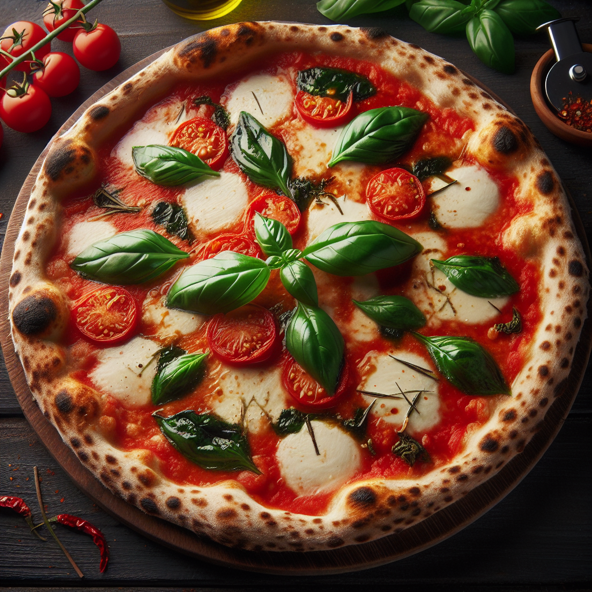

---
tags:
    - italien
    - lunch
    - middag
---
# Pizzadeg

## Ingredienser

- Vatten 500 g
- Salt 20 g
- Färsk jäst 5 g
- Mjöl 850 g
- Olivolja 10 g

## Gör så här

1. Häll upp vattnet och saltet i en bunke och rör om ordentligt tills saltet är helt upplöst. Sedan är det dags att blanda i olivoljan. Häll i den i vattnet och blanda om ordentligt och försök få oljan att dela upp sig i vattnet. Blanda därefter i jästen och se till att även den är helt upplöst.

    Häll 500 g av mjölet och mixa ihop allting stegvis till en väldigt blöt deg. Lägg därefter ut degen på bordet och häll ut resten av mjölet på bordet och knåda in resten av mjölet på bordet.
2. Fortsätt att knåda degen i minst 15 minuter efter att mjölet är tillagt. Degen ska vara mjuk och elastisk och inte klibba i händerna när den är klar.
3. När degen är knådad är det dags för den att vila. Gör en stor boll av degen och låt den sedan vila under en fuktig handduk och låt jäsa i 60 minuter i rumstemperatur.
4. Efter att degen fått vila i en timme är det dags att göra pizzabollar. Bollarna ska väga mellan 200-250 g.
5. När bollarna är klara lägger man dem i en plåt eller degbunke och täcker med lock eller plastfolie så tätt som man kan och låter den jäsa i 6-8 timmar till i rumstemperatur.
6. Baka därefter ut bollarna till pizzor, ha på önskade ingredienser och in i ugnen.
