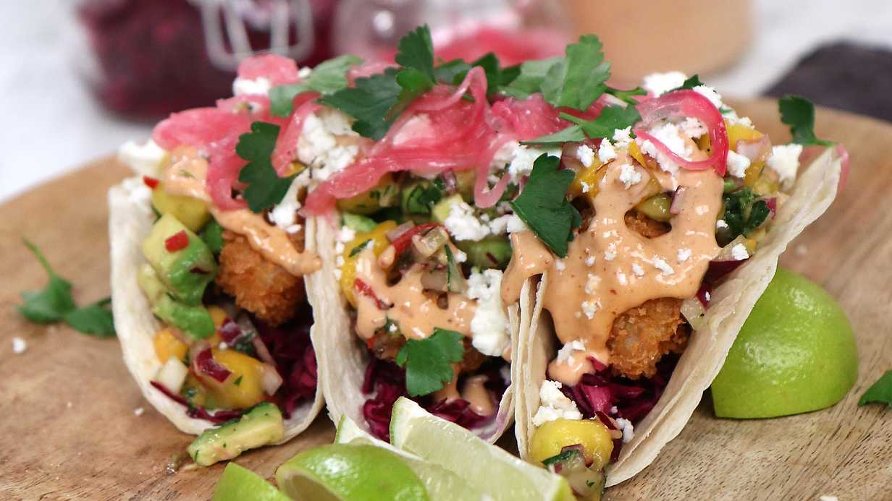

---
tags:
    - middag
---
# Crispy fish tacos med mango- och avokadosalsa

Supergod taco med frasigt panerad torsk serverad i mjuka tortillabröd med krispig kålsallad, het majo och en fruktig salsa på mango och avokado.

## Ingredienser

Bröd

- 2 dl vetemjöl
- 2 dl majsmjöl
- 3-4 msk olivolja
- 2 krm salt
- 2 dl vatten, kokande
- vetemjöl, till utbakningen

Kålsallad

- 200 g rödkål
- 0,5 grapefrukt
- 0,5 msk olivolja

Mango- och avokadosalsa

- 250 g mango
- 2 avokador
- 0,5 dl persilja, finhackad
- 1 rödlök (liten)
- 1 röd chilifrukt
- 1 msk olivolja
- 1 limefrukt

Chipotlemajonnäs

- 1 ägg
- 1-1,5 dl rapsolja
- 1 tsk dijonsenap
- 2 tsk äppelcidervinäger
- 2 msk chipotlepasta

Picklad rödlök

- 1 rödlök
- 1 dl ättiksprit 12 %
- 2 dl strösocker
- 3 dl vatten

Pankofriterad torsk

- 600 g torskrygg
- 2 dl vetemjöl
- 2 msk cayennepeppar
- 2 dl pankoströbröd (asiatiskt ströbröd)
- 2 ägg
- 1 l frityrolja
- salt
- svartpeppar

Garnering

- rädisa
- persilja
- fetaost

## Gör så här

Picklad rödlök

1. Förbered gärna dagen innan. Koka upp ättika, socker, salt, svartpeppar och vatten i en kastrull. Skiva rödlöken med en mandolin och häll över den varma vätskan i en burk. Ställ i kylen över natten.

Bröd

1. Häll vetemjöl, majsmjöl och salt i en bunke. Tillsätt olivoljan och blanda till smulor, häll eventuellt på lite mer olja för att få degen smulig. Häll över vattnet och vänd samman till en jämn deg. Kavla ut till runda små tortillas i mjöl och stek på hög värme i torr stekpanna max en minut per sida.
2. Lägg i en handduk som gärna får vara lite fuktig men den kommer annars att bli det av ångan från de varma bröden. Låt ligga i handduk till servering så de blir mjuka.

Kålsallad

1. Skiva kålen tunt på mandolin. Kläm över saften från grapefrukten, skvätt över lite olja. Krydda med salt och peppar och massera så att smakerna går ihop. Låt stå.

Mango- och avokadosalsa

1. Finhacka mango och avokado, lägg i en skål. Kärna ur och finhacka chilin och häll ner. Finhacka rödlöken och blanda ner med saften från limen och olivoljan. Rör ner persilja, salt och peppar. Smaka av och smaka upp!

Chipotlemajonnäs

1. Knäck ägget i en bunke. Tillsätt senap och vinäger. Mixa med stavmixer medan du tillsätter oljan. När majonnäsen fått fin konsistens tillsätter du chipotle, salt och peppar efter smak.

Pankofriterad torsk

1. Skär torskryggen först på längden sedan på bredden så att du får som stavar.
2. Hetta upp oljan i en kastrull till cirka 170 grader. Lägg upp mjöl, panko och uppvispat ägg i tre olika skålar. Tillsätt salt och peppar samt cayenne i mjölet. Doppa sedan torsken i mjöl, sedan ägg och till sist i panko.
3. Fritera tills de är gyllenbruna.
4. Finhacka persiljan, skiva rädisorna på en mandolin och smula fetaosten. Lägg allt på en tallrik redo för upplägget.

Upplägg

1. Börja med att lägga upp bröden på en skärbräda eller tallrik. Lägg på kålsalladen, toppa med mango- och avokadosalsan. Lägg på torsken och toppa med rädisor, rödlök, majonnäs, fetaost och persilja.
