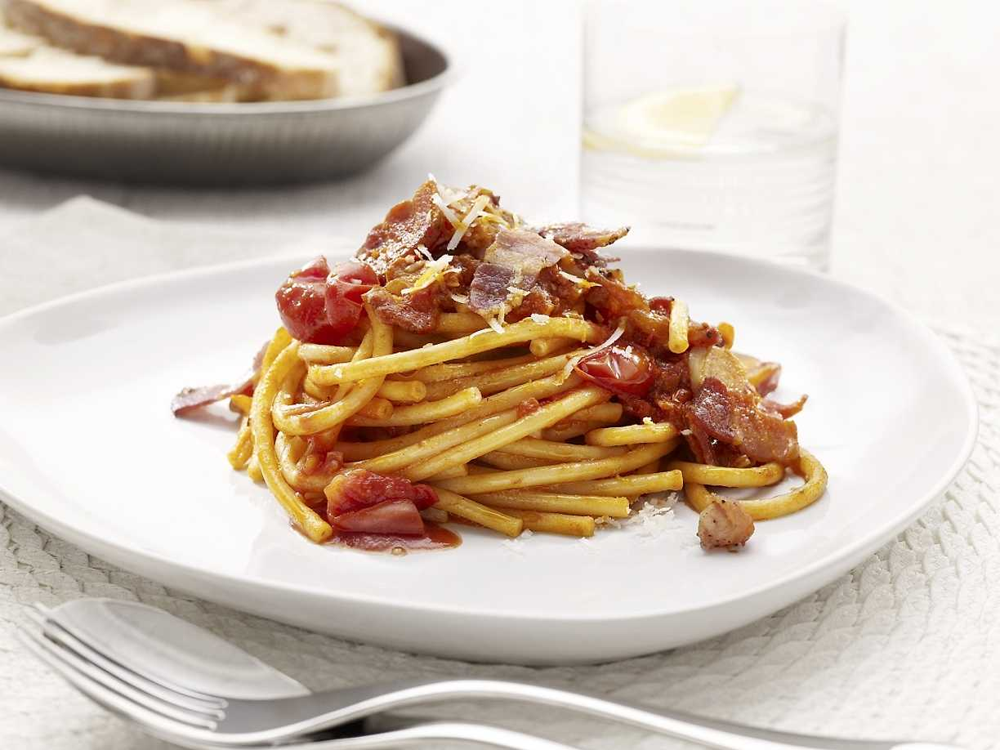

---
tags:
    - italien
    - kött
    - middag
---
# Bucatini Amatriciana

Bucatini med pancetta, körsbärstomater och pecorino.

## Ingredienser

- 400 g bucatini
- 0,5 gul lök, finhackad
- 0,5 dl olivolja
- 1 klyfta vitlök, skivad
- 300 g pancetta, tunt skivad (alt skivat stekfläsk)
- 1 krm peperoncini, torkad och smulad
- 1,5 msk tomatpuré
- 400 g konserverade körsbärstomater
- 1 krm salt
- 75 g pecorinoost
- 1 dl vatten (från pastakoket)

## Gör så här

1. Värm oljan i stekpannan.
2. Stek pancettan tills den får fin yta.
3. Lyft ur pancettan och låt rinna av på hushållspapper. Lämna fettet i pannan.
4. Lägg i lök, vitlök och peperoncini. Stek på medelhög värme tills löken blivit genomskinlig.
5. Lägg i tomatpuré. Stek 1 minut, tillsätt körsbärstomater och krossa sönder tomaterna i pannan.
6. Tillsätt salt. Låt koka ihop på låg värme i fem-tio minuter.
7. Koka pastan enligt anvisningar på paketet.
8. Lägg i pancettan i tomatsåsen men spar lite till garnering.
9. Tillsätt riven pecorino, spar lite till garnering.
10. Låt såsen småputtra tills pastan kokat klart.
11. Blanda ihop pasta, 1 dl vatten från pastakoket och sås.
12. Toppa med pecorino och pancetta.
