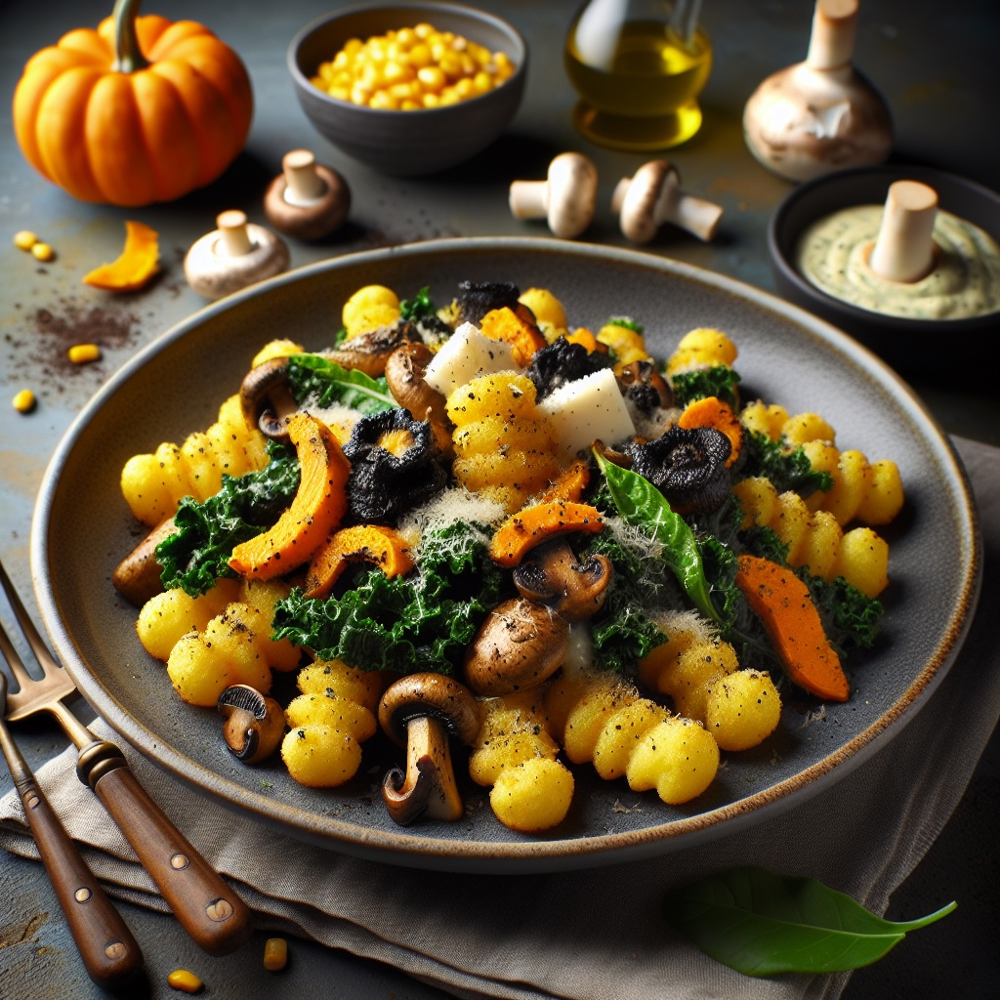

---
tags:
    - italien
    - pasta
    - lunch
    - middag
---
# Stekt gnocchetti med svartkåls- & pumpa-pesto

## Ingredienser

- 800 g färsk gnocchetti
- 300 g kantareller
- 1 paket parmaskinka
- 1 msk smör
- 1 msk + 1 msk olivolja
- 1 tsk flingsalt
- 1 krm nymald svartpeppar

Pesto

- 1 vitlöksklyfta
- 100 g svartkål
- 50 g pumpakärnor
- 25 g pecorinoost, lagrad
- 0,5 kruka basilika
- 0,5 tsk + 0,5 dl olivolja
- 1 krm salt
- 0,5 tsk citronpeppar
- 1 krm chiliflakes

Majstryffelcrème

- 1 bananschalottenlök
- 3 dl majskorn (200 g)
- 2 msk smör
- 2,5 dl mellangrädde
- 0,5 tsk tryffelolja
- 1 tsk salt
- 2 krm nymald svartpeppar

Garnering

- 30 g pecorinoost, lagrad
- ärtskott

## Gör så här

Parmaskinka

1. Sätt ugnen på 150°C.
2. Lägg skinkorna på en plåt och torka i ugnen i 5-15 minuter.

Pesto

1. Skala vitlöksklyftan.
2. Koka upp lättsaltat vatten i en liten kastrull och lägg i vitlöks-klyftan.
3. Repa svartkålen.
4. Förväll kålen i vattnet i ca 1 min. Häll av kål och vitlök i en sil och spola med kallt vatten. Låt rinna av.
5. Rosta pumpakärnorna i en het stekpanna i 0,5 tsk olja tills de fått fin färg. Låt svalna. Lägg undan 2 msk till garnering.
6. Lägg kål, vitlök och pumpakärnor i en mixerskål. Tillsätt basilika, 0,5 dl olja, salt, citronpeppar och chiliflakes. Mixa med stavmixer till en pesto.

Majscrème

1. Skala och finskiva löken.
2. Fräs lök och majs i smör i en kastrull i ca 3 min.
3. Tillsatt grädden och låt sjuda i ca 10 min.
4. Mixa till en slät kräm med stavmixer och smaka av med tryffelolja.
5. Krydda med salt och peppar.

Pasta

1. Koka gnocchettin enligt anvisning på förpackningen.
2. Häll av i en sil och spola med kallt vatten för att avstanna kokningen.
3. Låt rinna-av.
4. Ansa och stek svampen i en het stekpanna med smör och 1 msk olja.
5. Krydda med salt och peppar.
6. Lägg svampen pả ett fat.
7. Stek gnocchettin i 1 msk olja i stekpannan i 3-5 min.
8. Vänd ihop gnocchettin med svartkålspesto och lägg upp på tallrikar.
9. Strö över svamp och klicka pà majscrème.
10. Riv över ost och garnera med ärtskott och de sparade pumpakärnorna.
