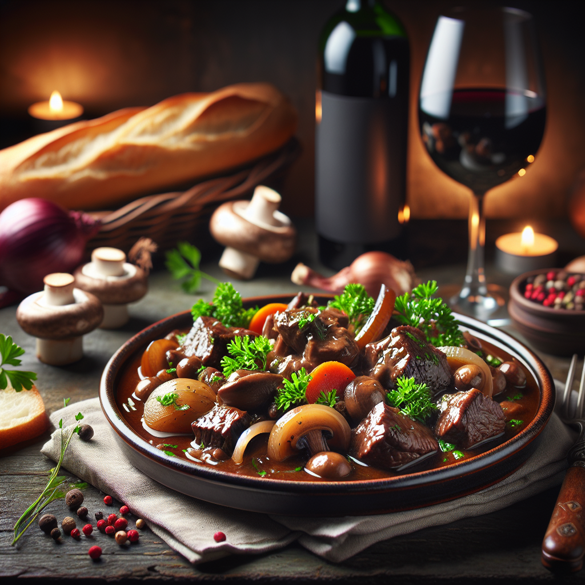

---
tags:
    - france
    - middag
---
# Boeuf bourguignon

## Ingredienser

- 1,2 kg högrev
- 1 msk smör, att steka köttet i
- 1 msk rapsolja, att steka köttet i
- 2 morötter
- 1 palsternacka, stor
- 1 gul lök, stor
- 3 klyftor vitlök
- 4 msk tomatpuré
- 2 msk vetemjöl
- 5 dl rött vin
- 3 kvistar färsk timjan
- 4 lagerblad
- 4 msk kalvfond, koncentrerad
- 2 msk grönsaksfond, koncentrerad
- 4-5 dl vatten (så det täcker grytan)
- 500 g steklök, små
- 250 g champinjoner, små
- 200 g sidfläsk, rökt (el. bacon)
- salt
- peppar
- persilja (till garnering)

Potatismos

- 1 kg potatis
- 1 riven vitlöksklyfta
- 25 g smör
- 1 dl vispgrädde
- 2 dl mjölk (3%)
- 1 tsk finrivet citronskal

## Gör så här

1. Tärna sidfläsket (eller strimla baconet) och stek i en panna.
2. Ta upp och lägg åt sidan.
3. Skär köttet i bitar och bryn det i samma stekpanna med smör och olja.
4. Krydda köttet med salt och peppar och lägg över i en stor gryta.
5. Tillsätt tomatpurén och vetemjölet i grytan, rör så att allt blandar sig fint.
6. Skär morötterna och palsternackan i grova bitar. Hacka löken i större bitar och hacka vitlöken. Fräs allt i samma stekpanna som köttet.
7. Häll på vin, timjankvistarna och lagerbladen. Koka upp och låt det puttra ca 5 minuter i stekpannan.
8. Häll sedan över allt i grytan med köttet. Tillsätt fond och sedan vatten så att det täcker ingredienserna (det kan vara mer än 4-5 dl beroende på hur stor gryta du använder).
9. Lägg tillbaks det stekta sidfläsket i grytan.
10. Låt köttet puttra i grytan tills det är mört, det tar ca 1-2 timmar.
11. Medan grytan puttrar kan du skala de små steklökarna och skiva champinjonerna grovt.
12. Stek steklökar och champinjoner i lite smör tills de tappat sitt vatten och fått fin färg.
13. Efter 1-2 timmar när grytan gått klart och köttet är mört tillsätt smålökar, svamp och bacon och låt puttra ytterligare 20-30 minuter.
14. Är grytan grytan vattnig, tillsätt lite maizenamjöl. Är den för tjock, späd med utspädd buljong.
15. Smaka av med salt och peppar.

Potatismos

1. Skala och koka potatisen mjuk i lättsaltat vatten.
2. Häll av och ånga av.
3. Fräs vitlöken i smöret.
4. Häll i grädde och mjölk och låt koka upp.
5. Pressa potatisen och vispa ihop med lökgrädden.
6. Tillsätt citronskal och smaka av med salt.
