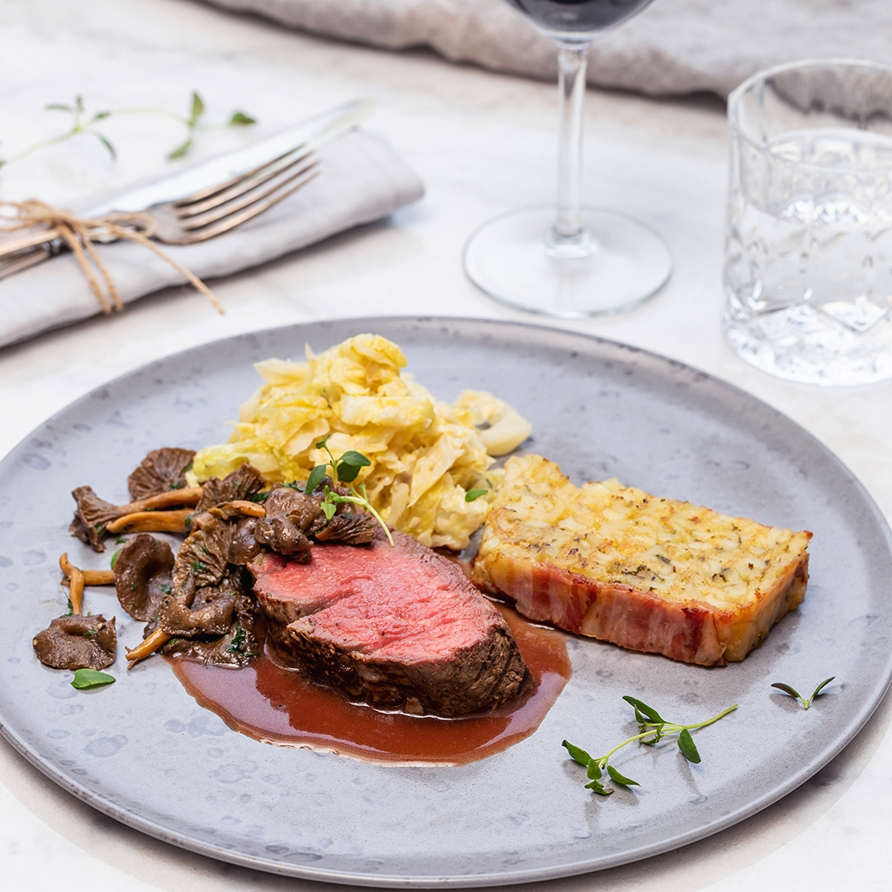

---
tags:
    - middag
---
# Helstekt oxfilé med lyxig italiensk potatiskaka

Lyxig oxfilé i gott sällskap av kantareller, krämig savoykål och en mjäll potatiskaka. Perfekt till festligare tillfällen som nyår! Tips! Börja med potatiskakan, den ska göras minst 3 timmar i förväg för att man ska kunna skära den i skivor.

## Ingredienser

Potatiskaka (räcker till 8 portioner)

- 280 g bacon, el. Italiensk pancetta
- 5 st bakpotatisar
- 200 g parmesanost
- 1/4 kruka färsk basilika, (ca. 2 msk) finstrimlad
- 1 msk färsk körvel, finstrimlad
- 1 tsk torkad timjan
- 1 msk majsstärkelse
- 1 krm salt
- 1 krm svartpeppar

Oxfilé

- 500 g hel oxfilé
- 1 msk mat- och baksmör
- 1 msk olivolja
- 1 krm salt
- 1 krm svartpeppar

Krämig savoykål

- 1 st schalottenlök
- 200 g savoykål, el. grönkål, strimlad
- 1 msk mat- och baksmör
- 1/2 dl vitt vin
- 1,5 dl vispgrädde
- 1 krm salt
- 1 krm svartpeppar

Rödvinssky

- 1/2 st gul lök
- 1 klyfta vitlök
- 1 msk mat- och baksmör
- 2 dl rött vin
- 1/2 msk kalvfond
- 1 krm torkad timjan
- 1 krm strösocker
- 1 st lagerblad
- 1/2 msk majsstärkelse
- 1 krm salt
- 1 krm svartpeppar

Smörstekta kantareller

- 3 dl färska kantareller
- 1 msk mat- och baksmör
- 1 msk färsk persilja, hackad
- 1 krm salt
- 1 krm svartpeppar

Till garnering & servering

- 1/4 kruka färsk timjan
- Flingsalt
- Svartpeppar, nymalen

## Gör så här

Italiensk potatiskaka:

1. Förbered gärna kakan dagen innan, som minst tre timmar innan servering. Sätt ugnen på 185 grader. Klä insidan av en avlång sockerkaksform med baconskivorna genom att lägga ner skivorna rakt över formen så att ändarna hänger ut på långsidorna av formen. Lägg baconskivorna som ”takpannor” så att skivorna överlappar varandra.
2. Skala och riv potatisen grovt, riv även parmesanosten grovt. Finhacka basilika och körvel. Blanda potatis, parmesanost, basilika, körvel, timjan och majsstärkelse i en stor bunke. Smaka av med salt och peppar.
3. Pressa ut vätskan från potatisblandningen och fyll den baconklädda formen. Vik över baconändarna så att skarvarna möts.
4. Placera ett smörpapper ovanpå potatiskakan och ställ en tung form eller annat ugnståligt tungt material ovanpå då potatiskakan ska ligga under press när den gräddas. Risken är annars att baconskivorna släpper från ovansidan.
5. Grädda potatiskakan i mitten av ugnen i ca 60 minuter. När potatiskakan är klar så ska den kallna under press i kylskåpet minst 2 timmar. På så sätt kan du enklare skära upp potatiskakan i fina skivor. Det går också bra att förbereda kakan dagen innan.

Oxfilé:

1. Sätt ugnen på 150 grader. Putsa oxfilén och stek i smör och olivolja gyllenbrun runt om i en stekpanna. Salta och peppra.
2. Stek oxfilén medium till en innertemperatur på ca 53-55 grader och låt filén sedan vila ca 10 minuter. Under tiden oxfilén går i ugnen förbereder du kålen, svampen och såsen.

Krämig savoykål

1. Finhacka schalottenlök och strimla kålen. Fräs schalottenlöken tillsammans med kålen i några minuter i smör.
2. Tillsätt vitt vin och grädde. Låt kålen sjuda på svag värme så att grädden kokar in och blir krämig. Smaka av med salt och peppar.

Rödvinssky

1. Finhacka löken och vitlöksklyftan. Fräs lök och vitlök i lite smör i en kastrull.
2. Häll på rödvin och kalvfond tillsammans med timjan, socker och lagerblad.
3. Låt skyn koka ner till hälften och red av med lite majsstärkelse. Sila skyn i en finmaskig sil och smaka av med salt och peppar.

Smörfrästa kantareller:

1. Innan serveringen steks kantarellerna i smör och finstrimlad persilja. Krydda med salt och peppar.

Servering

1. Skär potatiskakan i tjocka skivor och värm dem i ugnen på 150 grader i 15 min eller i en stekpanna.
2. Skiva upp oxfilén och lägg skivorna på den varma savoykålen.
3. Strö de smörstekta kantarellerna ovanpå och garnera med färsk timjan, flingsalt och några varv från svartpepparkvarnen. Avsluta med att hälla på lite rödvinssky över köttet.
