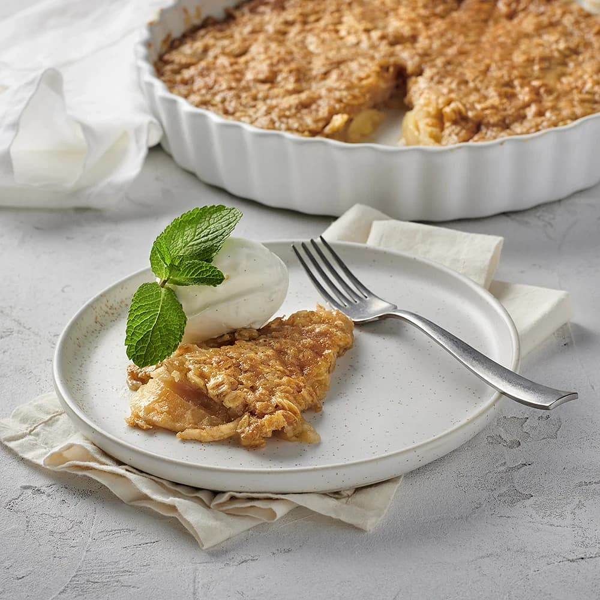

---
tags:
    - amerika
    - efterrätt
---
# Bittes äppelpaj

## Ingredienser

- 4 - 6 äpplen (ca 800 g)
- 150 g smör
- 3 dl havregryn
- 2 dl socker
- 1/2 dl ljus sirap
- 1 1/2 dl vetemjöl
- 1/2 tsk bakpulver
- 2 msk mjölk

## Gör så här

1. Sätt ugnen på 175°C.
2. Smält smöret i en kastrull. Dra av från värmen. Blanda i alla övriga ingredienser utom äpplena.
3. Skala, kärna ur och skiva äpplena tunt. Lägg äpplena i en smord ugnssäker form. Fördela smeten över.
4. Ställ in mitt i ugnen ca 35 minuter eller tills pajen är gyllenbrun och knäckig. Servera med glass eller vaniljvisp.
