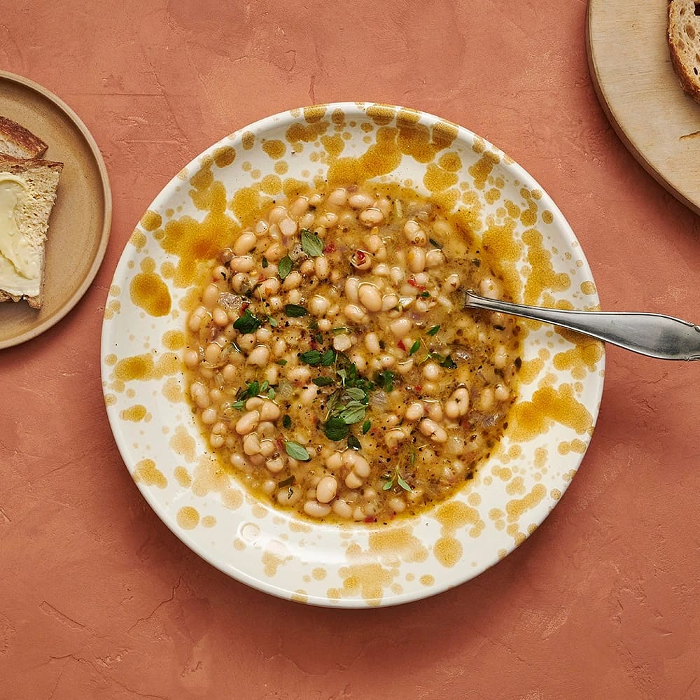

---
tags:
    - vegetariskt
    - middag
---
# Böngryta med timjan

En vegetarisk böngryta passar fint som vardagsmat! Här med vita bönor, lök, buljong och timjan. Servera grytan med en bit bröd.

## Ingredienser

- 200 g blandad lök
- 1 vitlöksklyfta
- 2 msk olivolja
- 2 krm salt
- 2 förp kokta små vita bönor (à 380 g)
- 1/2 kruka timjan
- 1 grönsaksbuljongtärning
- 3 dl vatten
- 1/2 tsk chiliflakes
- 1 tsk finrivet citronskal
- 2 tsk färskpressad citronjuice
- 1 krm svartpeppar

Till servering

- ev färsk timjan
- bröd

## Gör så här

1. Skala och strimla löken. Skala och hacka vitlöken. Stek lök och vitlök i olivoljan ca 5 minuter tills den mjuknar. Krydda med salt.
2. Häll av och skölj bönorna. Hacka timjanen. Tillsätt bönorna, buljongtärningen, vatten, timjan och chiliflakes. Låt koka ihop ca 10 minuter och smaka av med citronskal- och juice, salt och peppar.
3. Till servering: Toppa gärna med extra timjan. Servera med bröd.
