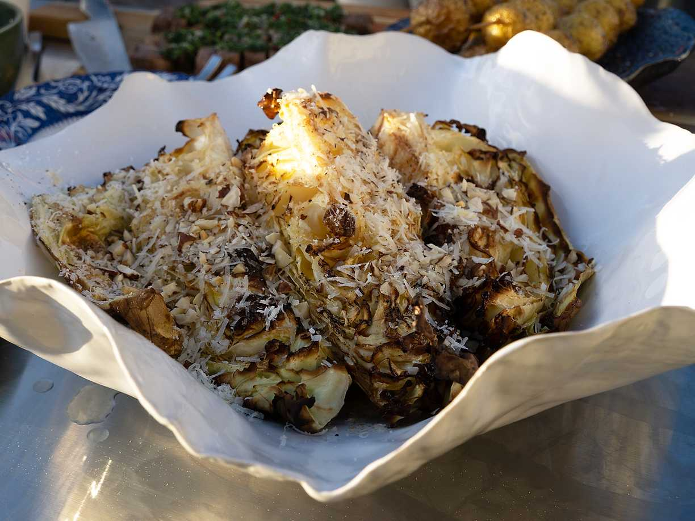

---
tags:
    - vegetariskt
    - förrätt
    - middag
---
# Grillad spetskål med brynt smör

## Ingredienser

- 1 spetskål
- 100 g smör
- 1 msk citronsaft, färskpressad
- 1 msk hasselnötter
- 25 g parmesanost
- havssalt

## Gör så här

1. Rosta hasselnötterna och grovhacka.
2. Dela spetskålen i fyra och grilla på indirekt värme 10 minuter sedan direkt värme till önskad färg.
3. Bryn under tiden smöret och vispa ner citronsaft och hasselnötter. När spetskålen är klar häller du på smöret och riv över osten.
4. Toppa med havssalt i slutet.
