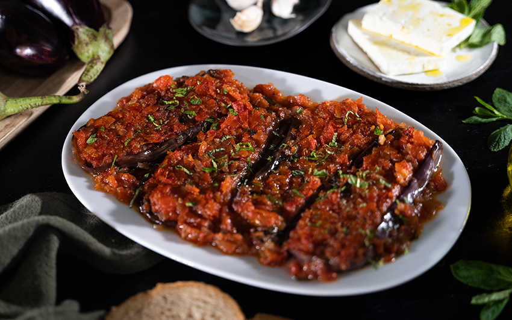

---
tags:
    - grekland
    - vegetariskt
    - middag
    - förrätt
---
# Imam Bayildi

En klassisk grekisk vegetarisk rätt där auberginer skärs upp och fylls med en kryddig blandning av lök, vitlök och tomater, sedan toppas med fetaost. Namnet betyder "imamen svimmade" - enligt legenden av den fantastiska doften från denna läckra rätt!

## Ingredienser

För auberginerna

- 4 auberginer
- 2 msk olivolja
- salt och svartpeppar
- 1 msk timjan

För fyllningen

- 2 gula lökar
- 2 msk olivolja
- 3 vitlöksklyftor
- 1/2 tsk strösocker
- 1/4 tsk spiskummin
- salt och svartpeppar
- 1/2 msk tomatpuré
- 200 g krossade tomater (burk)
- 1/2 msk timjan

För sammansättning

- 200 g fetaost
- svartpeppar
- olivolja

Till servering

- 1/3 kruka persilja
- rucola
- svartpeppar
- olivolja

## Gör så här

1. Dela auberginerna på längden.
2. Gör horisontella snitt på varje aubergine med en kniv.
3. Öppna försiktigt snitten lite grann, se till att de inte går sönder helt. Salta auberginerna generöst både i snitten och på ytan. Låt vila i 30-60 minuter.
4. Skölj av saltet från auberginerna och torka dem väl med hushållspapper. Krama försiktigt för att få ut överskottsvätska.
5. Sätt ugnen på 180°C.
6. Tillsätt olivolja, peppar och timjan i snitten på de saltade auberginerna.
7. Lägg auberginerna i en ugnsform och rosta i 40 minuter.

Fyllningen

8. Sätt en panna på hög värme. Skiva löken tunt.
9. När pannan är riktigt het, tillsätt 2 msk olivolja och löken.
10. Hacka vitlöken fint och tillsätt i pannan.
11. Tillsätt socker, spiskummin, salt och peppar. Fräs på låg värme i 15-20 minuter tills löken är vackert karamelliserad.
12. Tillsätt tomatpuré, krossade tomater och timjan. Rör om och låt sjuda i 5 minuter. Ta från värmen.

Sammansättning

13. Ta ut auberginerna från ugnen och använd en sked för att trycka ner snitten du gjorde tidigare så att du får plats för fyllningen.
14. Fördela fyllningen mellan auberginerna och strö över fetaost och peppar. Ringla över olivolja och baka i 15-20 minuter till.
15. För servering, lägg ut rucola på ett serveringsfat, lägg på auberginerna med lite finhackad persilja, peppar och extra virgin olivolja.
