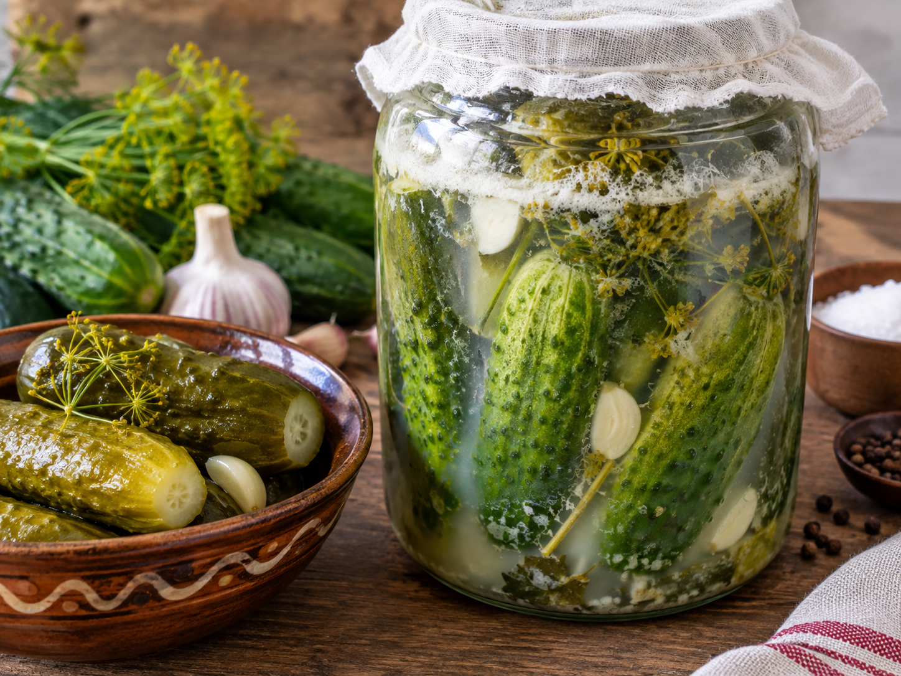

---
tags:
    - ungern
    - vegetariskt
    - middag
---
# Kovászos uborka

## Ingredienser

- 1 kg små inläggsgurkor
- 4 vitlöksklyftor
- 1 knippe krondill
- 2 l kokt vatten med 2 msk salt
- 1 stor skiva stenugnsbakat bröd

## Gör så här

1. Täck botten med 1/2 knippe krondill
2. Ställ gurkorna uppåt
3. Lägg i 2 hela vitlöksklyftor, ett lager till med gurka, vitlök och krondill på toppen
4. Häll i det kokta vattnet så det täcker, avsluta med brödet
5. Sätt på ett fat som lock
6. Ställ i solen ca 7 dagar
