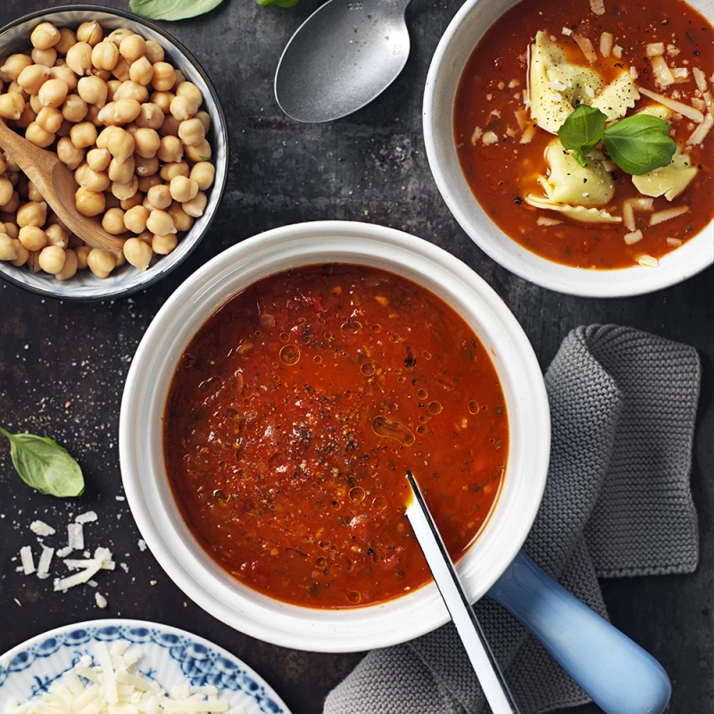

---
tags:
    - lunch
    - middag
---
# Tomatsoppa med tortellini och parmesan

## Ingredienser

- 1 gul lök
- 2 vitlöksklyftor
- 1 röd chili
- neutral olja
- 800 g hela skalade tomater
- 0,75 dl soltorkade tomater
- 6 dl vatten
- 1 msk färsk oregano
- 1/2 msk balsamvinäger
- 1/2 msk honung
- 1/2 dl hackad basilika
- salt och svartpeppar

Till servering

- 250 g färsk tortellini
- 1 dl grovriven parmesanost
- färsk basilika

## Gör så här

1. Stek lök, vitlök och chili i olja tills löken är mjuk. Tillsätt tomater, vatten, oregano, vinäger och honung. Låt koka ca 20 min under lock. Mosa sönder tomaterna, vänd ner basilikan och smaka av med salt och peppar.
2. Koka pastan enligt anvisning på förpackningen och servera soppan med pasta, kikärter, parmesan och basilikablad.
